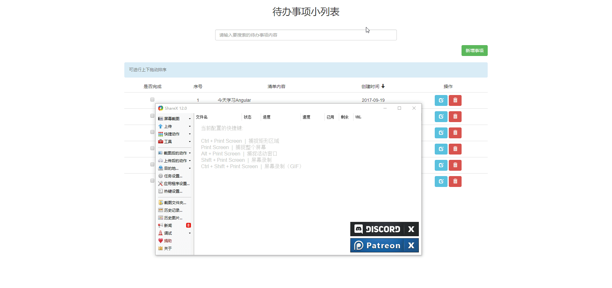

# angular-todos
使用AngularJs编写的待办事项小案例

功能包括：
  1. 增，删，改，查，待办事项内容
  
  2. 点击头部创建时间反选按时间所降升排序，
  
  3. 上下拖动排序 -- 这里使用了一个Sortable.js库，传送门 [https://github.com/RubaXa/Sortable](https://github.com/RubaXa/Sortable)
  
  > 注意：如果要将拖动排序后的数据存到数据库时，最好不要使用orderBy过滤器。如果按照事件点击反选排序后的数据存到数据库时，需编写一个点击事件，
  将排序的方式作为参数传递个后台。
  
  > 踩坑：动态获取数据遍历，使用orderBy过滤器控制台报错 
  `Error: [orderBy:notarray] http://errors.angularjs.org/1.6.5/orderBy/notarray?p0=%7B%7D`；
  
  ``` javascript
   // 解决方法使用$filter('orderBy')过滤器， student表示数据中需要排序的属性名 例如：
    $scope.tbOrgDetail = [];
    course_manage.getCourseBySubjectID(id, function(result) {
        $scope.tbOrgDetail = $filter('orderBy')(result.data, 'student') ;
    });
  ```
  
  项目演示：
  
